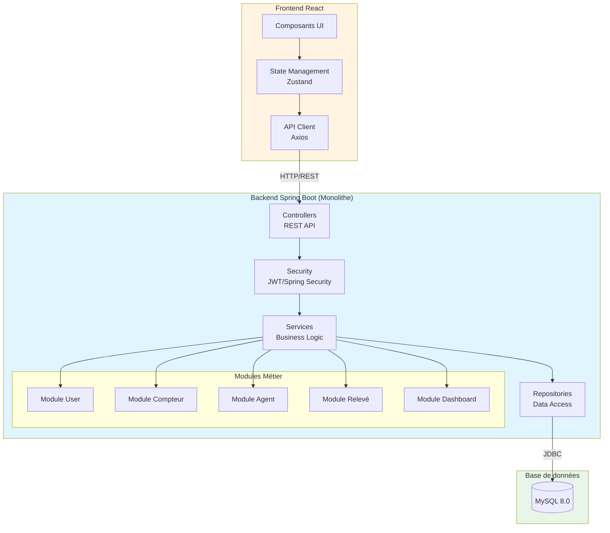
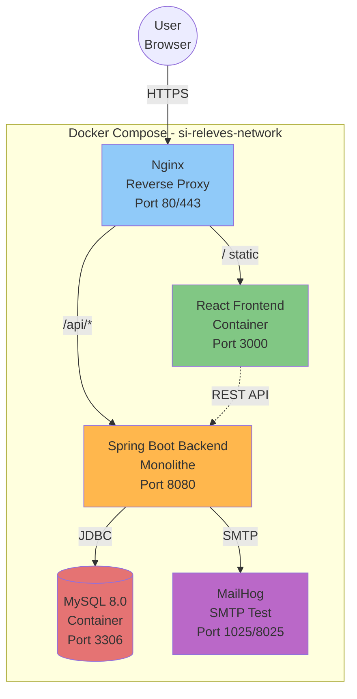
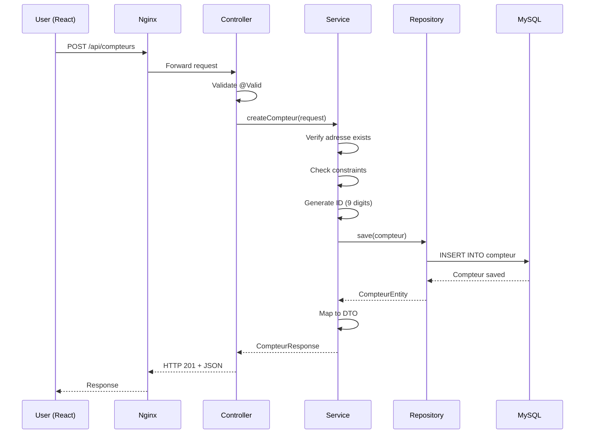

# COMPLÉMENT ARCHITECTURE TECHNIQUE - ARCHITECTURE LOGICIELLE

**Projet :** Système de Gestion des Relevés de Compteurs d'Eau et d'Électricité  
**Client :** RABAT ENERGIE & EAU (REE)  
**Date :** 16 Décembre 2024

---

## SECTION À AJOUTER AU DOCUMENT PHASE 2.5

Cette section complète le document d'architecture technique en explicitant le **choix d'architecture logicielle** (monolithique vs microservices).

---

## 1. CHOIX D'ARCHITECTURE LOGICIELLE

### 1.1. Architecture retenue : MONOLITHE MODULAIRE

**Décision :** Le système SI Relevés sera développé selon une **architecture monolithique modulaire**.

**Définition :**
- **Monolithe :** Application déployée comme une seule unité (1 backend Spring Boot, 1 frontend React)
- **Modulaire :** Organisation interne en modules logiques cohérents et découplés

---

### 1.2. Justification du choix

#### **Analyse du contexte projet**

| Critère | Évaluation | Impact sur le choix |
|---------|------------|---------------------|
| **Taille du système** | Moyenne (7 entités, ~15 endpoints API) | ✅ Monolithe adapté |
| **Équipe de développement** | Petite équipe (projet académique) | ✅ Monolithe plus simple |
| **Complexité métier** | Faible à moyenne (domaine bien défini) | ✅ Pas besoin de microservices |
| **Couplage fonctionnel** | Fort (compteurs ↔ relevés ↔ agents) | ✅ Monolithe évite la complexité distribuée |
| **Besoins de scalabilité** | Faible (usage interne REE) | ✅ Pas de besoin de scaling horizontal |
| **Contraintes de performance** | Modérées (quelques centaines d'utilisateurs) | ✅ Monolithe suffisant |
| **Budget temps** | Limité (projet académique avec deadline) | ✅ Monolithe plus rapide à développer |
| **Déploiement** | Local avec Docker Compose | ✅ Monolithe simplifie l'infrastructure |
| **Expérience équipe** | Variable | ✅ Monolithe plus accessible |

---

### 1.3. Comparaison : Monolithe vs Microservices

| Aspect | Monolithe Modulaire ✅ | Microservices ❌ |
|--------|----------------------|------------------|
| **Complexité architecture** | Faible | Élevée |
| **Nombre de projets** | 2 (backend + frontend) | 5+ (gateway + 3-4 services + frontend) |
| **Communication** | Appels de méthodes Java | HTTP/REST ou messaging (latence réseau) |
| **Transactions** | ACID simple (1 base) | Distribuées (Saga pattern complexe) |
| **Base de données** | 1 MySQL | 3-4 MySQL (1 par service) |
| **Déploiement** | 1 conteneur backend | 4-5 conteneurs + orchestration |
| **Temps de développement** | Rapide | Long (overhead infrastructure) |
| **Courbe d'apprentissage** | Faible | Élevée (Spring Cloud, patterns distribués) |
| **Tests** | Simples (tests unitaires + intégration) | Complexes (tests inter-services) |
| **Debugging** | Facile (1 application) | Difficile (traces distribuées) |
| **Infrastructure requise** | Docker Compose | Service Discovery, API Gateway, Config Server |
| **Performance** | Excellente (pas de latence réseau) | Bonne (overhead réseau) |
| **Scalabilité** | Verticale (suffisante pour le projet) | Horizontale (non nécessaire ici) |
| **Coût opérationnel** | Faible | Élevé |
| **Adapté au projet académique** | ✅ OUI | ❌ NON (surcharge inutile) |

---

### 1.4. Avantages du monolithe pour SI Relevés

#### ✅ **Simplicité de développement**
- Un seul projet backend à maintenir
- Code partagé facilement (entités, DTOs, utilitaires)
- Pas de duplication de code entre services
- Refactoring simple et rapide

#### ✅ **Performance optimale**
- Appels de méthodes directs (pas de latence réseau)
- Pas de sérialisation/désérialisation JSON entre services
- Transactions ACID natives
- Requêtes SQL optimisées (JOIN possibles)

#### ✅ **Développement rapide**
- Configuration unique
- Un seul point d'entrée pour le debug
- Tests plus simples et rapides
- Déploiement instantané

#### ✅ **Infrastructure simplifiée**
- Pas besoin de Service Discovery (Eureka)
- Pas besoin d'API Gateway
- Pas besoin de Config Server
- Docker Compose suffit

#### ✅ **Coût réduit**
- Moins de ressources serveur (1 conteneur backend au lieu de 5)
- Moins de complexité opérationnelle
- Maintenance plus simple

#### ✅ **Adapté au contexte académique**
- Focus sur la qualité du code métier
- Démonstration claire de l'utilisation de l'IA
- Temps concentré sur les fonctionnalités, pas l'infrastructure

---

### 1.5. Inconvénients du monolithe (et mitigations)

| Inconvénient | Mitigation dans notre architecture |
|--------------|-----------------------------------|
| **Couplage fort** | ✅ Organisation modulaire interne (packages par domaine) |
| **Difficulté à scaler** | ✅ Scalabilité verticale suffisante pour le projet |
| **Déploiement tout-ou-rien** | ✅ Tests automatisés + CI/CD pour limiter les risques |
| **Monolithe peut grossir** | ✅ Projet de taille maîtrisée (pas d'ajout fonctionnel majeur prévu) |
| **Technologie unique** | ✅ Spring Boot + React sont des choix modernes et pertinents |

---

## 2. ARCHITECTURE LOGICIELLE DÉTAILLÉE

### 2.1. Architecture en couches (Layered Architecture)

Le backend Spring Boot suit une **architecture en 4 couches** :

```
┌─────────────────────────────────────────────────────────────┐
│                    PRESENTATION LAYER                        │
│                   (Couche Présentation)                      │
│  ┌───────────────────────────────────────────────────────┐  │
│  │  REST Controllers                                      │  │
│  │  ┌─────────────────────────────────────────────────┐  │  │
│  │  │  @RestController                                 │  │  │
│  │  │  - UserController                                │  │  │
│  │  │  - CompteurController                            │  │  │
│  │  │  - AgentController                               │  │  │
│  │  │  - ReleveController                              │  │  │
│  │  │  - DashboardController                           │  │  │
│  │  │  - AuthController                                │  │  │
│  │  └─────────────────────────────────────────────────┘  │  │
│  │                                                         │  │
│  │  Responsabilités :                                     │  │
│  │  - Exposition endpoints REST                           │  │
│  │  - Validation requêtes HTTP (@Valid)                   │  │
│  │  - Mapping DTO ↔ Entités                              │  │
│  │  - Sérialisation/Désérialisation JSON                 │  │
│  │  - Codes de statut HTTP (200, 201, 400, 404, 409...)  │  │
│  └───────────────────────────────────────────────────────┘  │
└─────────────────────────────────────────────────────────────┘
                           ↕️ Appels de méthodes
┌─────────────────────────────────────────────────────────────┐
│                     SERVICE LAYER                            │
│                    (Couche Métier)                           │
│  ┌───────────────────────────────────────────────────────┐  │
│  │  Business Logic Services                               │  │
│  │  ┌─────────────────────────────────────────────────┐  │  │
│  │  │  @Service                                        │  │  │
│  │  │  - UserService                                   │  │  │
│  │  │  - CompteurService                               │  │  │
│  │  │  - AgentService                                  │  │  │
│  │  │  - ReleveService                                 │  │  │
│  │  │  - DashboardService                              │  │  │
│  │  │  - AuthService                                   │  │  │
│  │  │  - EmailService                                  │  │  │
│  │  └─────────────────────────────────────────────────┘  │  │
│  │                                                         │  │
│  │  Responsabilités :                                     │  │
│  │  - Logique métier (règles de gestion)                 │  │
│  │  - Orchestration des opérations                        │  │
│  │  - Transactions (@Transactional)                       │  │
│  │  - Validation métier                                   │  │
│  │  - Génération d'ID compteurs                          │  │
│  │  - Calcul de consommation                             │  │
│  │  - Calcul de KPIs                                     │  │
│  └───────────────────────────────────────────────────────┘  │
└─────────────────────────────────────────────────────────────┘
                           ↕️ Appels de méthodes
┌─────────────────────────────────────────────────────────────┐
│                   PERSISTENCE LAYER                          │
│                   (Couche Persistance)                       │
│  ┌───────────────────────────────────────────────────────┐  │
│  │  Repositories (Spring Data JPA)                        │  │
│  │  ┌─────────────────────────────────────────────────┐  │  │
│  │  │  @Repository (interfaces)                        │  │  │
│  │  │  - UserRepository extends JpaRepository         │  │  │
│  │  │  - CompteurRepository                            │  │  │
│  │  │  - AgentRepository                               │  │  │
│  │  │  - ReleveRepository                              │  │  │
│  │  │  - ClientRepository                              │  │  │
│  │  │  - QuartierRepository                            │  │  │
│  │  └─────────────────────────────────────────────────┘  │  │
│  │                                                         │  │
│  │  Responsabilités :                                     │  │
│  │  - Accès aux données                                   │  │
│  │  - Opérations CRUD                                     │  │
│  │  - Requêtes personnalisées (@Query)                    │  │
│  │  - Mapping ORM (Hibernate/JPA)                         │  │
│  └───────────────────────────────────────────────────────┘  │
└─────────────────────────────────────────────────────────────┘
                           ↕️ JDBC
┌─────────────────────────────────────────────────────────────┐
│                      DATABASE LAYER                          │
│                     (Couche Données)                         │
│  ┌───────────────────────────────────────────────────────┐  │
│  │                    MySQL 8.0                           │  │
│  │  - Tables                                              │  │
│  │  - Triggers                                            │  │
│  │  - Procédures stockées                                 │  │
│  │  - Vues                                                │  │
│  │  - Index                                               │  │
│  └───────────────────────────────────────────────────────┘  │
└─────────────────────────────────────────────────────────────┘

              CROSS-CUTTING CONCERNS
              (Préoccupations transversales)
┌─────────────────────────────────────────────────────────────┐
│  🔒 Security (JWT, Spring Security)                         │
│  ⚠️  Exception Handling (GlobalExceptionHandler)            │
│  📝 Logging (SLF4J + Logback)                               │
│  ✅ Validation (Bean Validation JSR-380)                     │
│  🔄 DTO Mapping (MapStruct)                                  │
│  📊 Monitoring (Actuator)                                    │
└─────────────────────────────────────────────────────────────┘
```

---

### 2.2. Flux de données typique

**Exemple : Création d'un compteur**

```
1. Frontend React
   ↓ HTTP POST /api/compteurs
   
2. Nginx (Reverse Proxy)
   ↓ Routage vers backend
   
3. Spring Security Filter
   ↓ Validation JWT
   
4. @RestController CompteurController.createCompteur()
   ↓ Validation @Valid CreateCompteurRequest
   ↓ Appel service
   
5. @Service CompteurService.createCompteur()
   ↓ Logique métier :
   ↓ - Vérifier que l'adresse existe
   ↓ - Vérifier contraintes (max 2 compteurs/adresse)
   ↓ - Générer ID (9 chiffres)
   ↓ - Créer entité Compteur
   ↓ Appel repository
   
6. @Repository CompteurRepository.save()
   ↓ Hibernate/JPA génère SQL
   
7. MySQL
   ↓ INSERT INTO compteur
   ↓ Trigger vérifie contraintes
   
8. Réponse remonte
   ← CompteurEntity
   ← CompteurService (map vers DTO)
   ← CompteurController (return ResponseEntity)
   ← HTTP 201 Created + JSON
   
9. Frontend React
   ← Affiche confirmation
```

---

### 2.3. Organisation modulaire interne (packages)

Même dans un monolithe, on organise le code en **modules logiques** :

```
backend/src/main/java/ma/ree/sireleves/
│
├── SiRelevesApplication.java          # Point d'entrée Spring Boot
│
├── config/                             # Configuration globale
│   ├── SecurityConfig.java
│   ├── CorsConfig.java
│   ├── JwtConfig.java
│   ├── OpenApiConfig.java
│   └── WebConfig.java
│
├── security/                           # Sécurité (transversal)
│   ├── JwtTokenProvider.java
│   ├── JwtAuthenticationFilter.java
│   ├── UserDetailsServiceImpl.java
│   └── SecurityUtils.java
│
├── exception/                          # Gestion des erreurs (transversal)
│   ├── GlobalExceptionHandler.java
│   ├── ResourceNotFoundException.java
│   ├── BadRequestException.java
│   ├── ConflictException.java
│   └── UnauthorizedException.java
│
├── common/                             # Utilitaires communs
│   ├── dto/
│   │   ├── ApiResponse.java
│   │   └── PageResponse.java
│   ├── mapper/
│   │   └── BaseMapper.java
│   └── util/
│       ├── DateUtils.java
│       └── StringUtils.java
│
├── auth/                               # MODULE : Authentification
│   ├── controller/
│   │   └── AuthController.java
│   ├── service/
│   │   └── AuthService.java
│   └── dto/
│       ├── LoginRequest.java
│       ├── LoginResponse.java
│       └── ChangePasswordRequest.java
│
├── user/                               # MODULE : Gestion utilisateurs
│   ├── controller/
│   │   └── UserController.java
│   ├── service/
│   │   └── UserService.java
│   ├── repository/
│   │   └── UserRepository.java
│   ├── entity/
│   │   └── User.java
│   ├── dto/
│   │   ├── CreateUserRequest.java
│   │   ├── UpdateUserRequest.java
│   │   └── UserResponse.java
│   └── mapper/
│       └── UserMapper.java
│
├── compteur/                           # MODULE : Gestion compteurs
│   ├── controller/
│   │   └── CompteurController.java
│   ├── service/
│   │   ├── CompteurService.java
│   │   └── CompteurIdGenerator.java
│   ├── repository/
│   │   └── CompteurRepository.java
│   ├── entity/
│   │   └── Compteur.java
│   ├── dto/
│   │   ├── CreateCompteurRequest.java
│   │   ├── CompteurResponse.java
│   │   └── CompteurDetailResponse.java
│   └── mapper/
│       └── CompteurMapper.java
│
├── agent/                              # MODULE : Gestion agents
│   ├── controller/
│   │   └── AgentController.java
│   ├── service/
│   │   └── AgentService.java
│   ├── repository/
│   │   └── AgentRepository.java
│   ├── entity/
│   │   └── Agent.java
│   ├── dto/
│   │   ├── AgentResponse.java
│   │   ├── AgentDetailResponse.java
│   │   └── AffectAgentRequest.java
│   └── mapper/
│       └── AgentMapper.java
│
├── releve/                             # MODULE : Gestion relevés
│   ├── controller/
│   │   └── ReleveController.java
│   ├── service/
│   │   ├── ReleveService.java
│   │   └── ConsommationCalculator.java
│   ├── repository/
│   │   └── ReleveRepository.java
│   ├── entity/
│   │   └── Releve.java
│   ├── dto/
│   │   ├── CreateReleveRequest.java
│   │   ├── ReleveResponse.java
│   │   └── ReleveDetailResponse.java
│   └── mapper/
│       └── ReleveMapper.java
│
├── adresse/                            # MODULE : Gestion adresses
│   ├── repository/
│   │   └── AdresseRepository.java
│   ├── entity/
│   │   └── Adresse.java
│   └── dto/
│       └── AdresseResponse.java
│
├── quartier/                           # MODULE : Gestion quartiers
│   ├── repository/
│   │   └── QuartierRepository.java
│   ├── entity/
│   │   └── Quartier.java
│   └── dto/
│       └── QuartierResponse.java
│
├── client/                             # MODULE : Gestion clients
│   ├── repository/
│   │   └── ClientRepository.java
│   ├── entity/
│   │   └── Client.java
│   └── dto/
│       └── ClientResponse.java
│
├── dashboard/                          # MODULE : Tableaux de bord
│   ├── controller/
│   │   └── DashboardController.java
│   ├── service/
│   │   └── DashboardService.java
│   └── dto/
│       ├── KpiResponse.java
│       ├── TauxCouvertureResponse.java
│       └── ConsommationStatsResponse.java
│
├── report/                             # MODULE : Rapports
│   ├── controller/
│   │   └── ReportController.java
│   ├── service/
│   │   └── ReportService.java
│   └── dto/
│       ├── ReportRequest.java
│       └── ReportResponse.java
│
└── email/                              # MODULE : Envoi d'emails
    ├── service/
    │   └── EmailService.java
    └── template/
        └── EmailTemplate.java
```

**Avantages de cette organisation :**
- ✅ **Séparation claire des responsabilités** (chaque module = domaine métier)
- ✅ **Cohésion forte** (tout ce qui concerne les compteurs est dans `compteur/`)
- ✅ **Couplage faible** (les modules communiquent via interfaces)
- ✅ **Facilité de navigation** (structure intuitive)
- ✅ **Évolutivité** (ajout de modules facile)
- ✅ **Migration future facilitée** (si besoin de passer en microservices, chaque package devient un service)

---

### 2.4. Principes de conception appliqués

#### **2.4.1. SOLID Principles**

| Principe | Application dans le projet |
|----------|---------------------------|
| **S** - Single Responsibility | Chaque classe a une seule responsabilité (Controller = HTTP, Service = métier, Repository = données) |
| **O** - Open/Closed | Utilisation d'interfaces (ex: UserService interface + UserServiceImpl) |
| **L** - Liskov Substitution | Héritage respecté (ex: tous les Repository étendent JpaRepository) |
| **I** - Interface Segregation | Interfaces spécifiques (pas de mega-interface) |
| **D** - Dependency Inversion | Injection de dépendances (@Autowired, constructeur) |

#### **2.4.2. DRY (Don't Repeat Yourself)**
- DTOs mappés avec MapStruct (pas de mapping manuel répété)
- Gestion d'erreurs centralisée (GlobalExceptionHandler)
- Utilitaires réutilisables (DateUtils, StringUtils)

#### **2.4.3. Separation of Concerns**
- Couches bien séparées (Controller → Service → Repository)
- Aspects transversaux isolés (security/, exception/)

---

### 2.5. Patterns de conception utilisés

| Pattern | Où | Exemple |
|---------|-----|---------|
| **MVC** | Global | Model (Entity) - View (DTO) - Controller |
| **DTO (Data Transfer Object)** | Couche présentation | `CreateUserRequest`, `UserResponse` |
| **Repository** | Couche persistance | `UserRepository extends JpaRepository` |
| **Service Layer** | Couche métier | `UserService` avec `@Service` |
| **Dependency Injection** | Partout | `@Autowired` ou injection par constructeur |
| **Singleton** | Services | Spring gère les beans comme singletons |
| **Factory** | Génération ID | `CompteurIdGenerator.generate()` |
| **Strategy** | Validation | Different validators selon le contexte |
| **Exception Handler** | Gestion erreurs | `@ControllerAdvice` avec `@ExceptionHandler` |

---

## 3. DIAGRAMMES D'ARCHITECTURE

### 3.1. Diagramme de composants (Mermaid)



---

### 3.2. Diagramme de déploiement (Mermaid)



---

### 3.3. Diagramme de séquence - Création compteur



---

## 4. ÉVOLUTIVITÉ FUTURE

### 4.1. Migration vers microservices (si besoin)

**Grâce à l'organisation modulaire**, une migration future est facilitée :

**Étape 1 : Identifier les bounded contexts**
- Module `user` → Service User
- Module `compteur` → Service Compteur
- Module `releve` → Service Relevé

**Étape 2 : Extraire progressivement**
- Extraire un module à la fois
- Commencer par le module le moins couplé
- Garder le monolithe comme "legacy" temporairement

**Étape 3 : Gérer la transition**
- API Gateway pour router
- Strangler Pattern (étranglement progressif du monolithe)

**Mais pour ce projet académique, le monolithe est suffisant et optimal !**

---

## 5. CONCLUSION

### 5.1. Récapitulatif des choix

✅ **Architecture logicielle :** Monolithe modulaire  
✅ **Pattern architectural :** Layered Architecture (4 couches)  
✅ **Organisation :** Modules par domaine métier  
✅ **Déploiement :** Docker Compose (3 conteneurs principaux)  
✅ **Scalabilité :** Verticale (suffisante pour le projet)  
✅ **Complexité :** Faible (adapté équipe et délais)  

---

### 5.2. Bénéfices pour le projet académique

1. **Focus sur l'essentiel :** Temps concentré sur le code métier et l'utilisation de l'IA
2. **Facilité d'apprentissage :** Architecture accessible pour tous les niveaux
3. **Développement rapide :** Pas de surcharge infrastructure
4. **Qualité du code :** Principes SOLID et patterns appliqués
5. **Démonstration claire :** Architecture simple à présenter et expliquer
6. **Maintenance facilitée :** Code organisé et maintenable

---

**Cette architecture monolithique modulaire est le choix optimal pour le projet SI Relevés !** ✅

---

**Document généré automatiquement par IA - Claude (Anthropic)**  
**Justification : Architecture logicielle adaptée au contexte projet**
